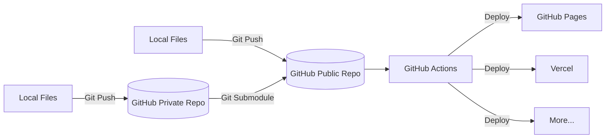
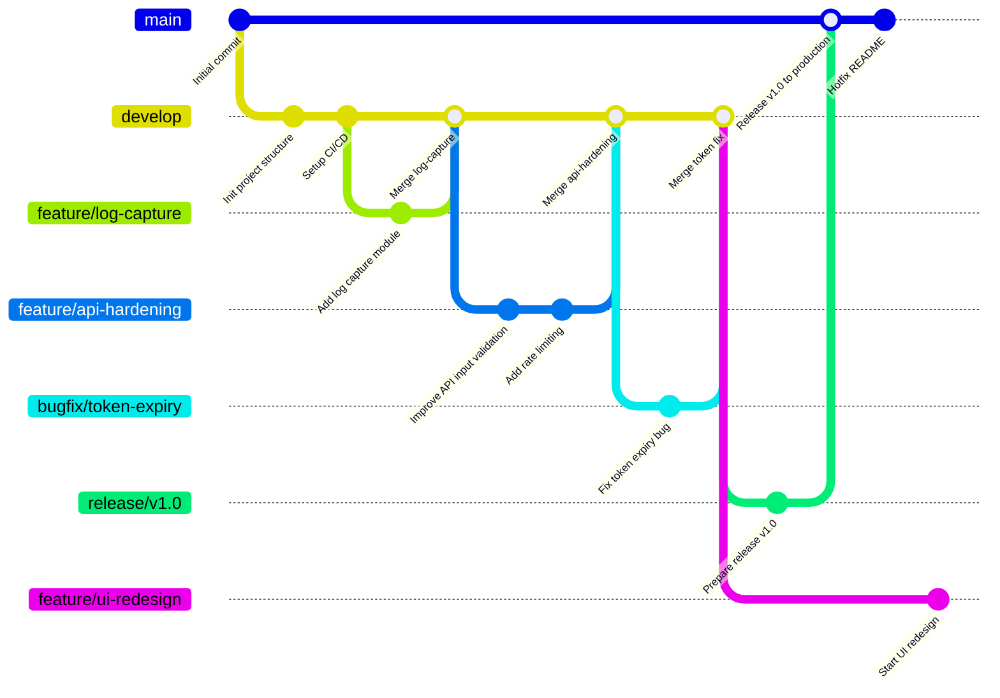

# GitHub Workflow

> "Behind every well-organized repo lies a story of purpose, experimentation, and constant iteration."

After years of hands-on experience in cybersecurity and development, I’ve learned that code is just one part of the battle. The **structure** we build around our work — our process, our repository, our mindset — is what allows our projects to scale, evolve, and remain resilient.

This GitHub Page is more than just a collection of code — it's a reflection of my workflow, my evolution, and the systems I’ve put in place to stay adaptable in a fast-changing world.

## Architecture

To give you a better idea of how I separate concerns and automate deployments, here's a simplified view of the repository workflow

Each directory, file, and branch serves a purpose. Here’s a high-level overview of how my main repository is structured:

## Branch

I follow a Git Flow-inspired model because it enforces discipline in collaborative work.
It allows features, hotfixes, and releases to evolve in parallel, with clear boundaries and responsibilities

Maintaining a clean and sustainable workflow is key in collaborative and long-term projects. Here’s the branching model I follow:

- **`main`** – The **production** branch. Only stable, reviewed, and tested code lives here.
- **`develop`** – The **integration** branch for ongoing development. Features are merged here after review and testing.
- **`feature/*`** – Used for individual feature development (e.g., `feature/log-capture`, `feature/api-hardening`).
- **`bugfix/*`** – Quick patches or specific bug resolutions.
- **`release/*`** – For preparing stable releases, including documentation and final testing.

This structure allows me to stay agile while ensuring quality and traceability in the work I deliver.



<!--

-->

---

> Author: [ProxyGeek](https://github.com/Pr0xyG33k)  
> URL: https://Pr0xyG33k.github.io/posts/github/  

