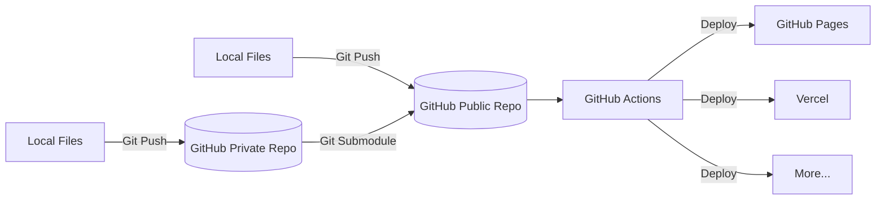
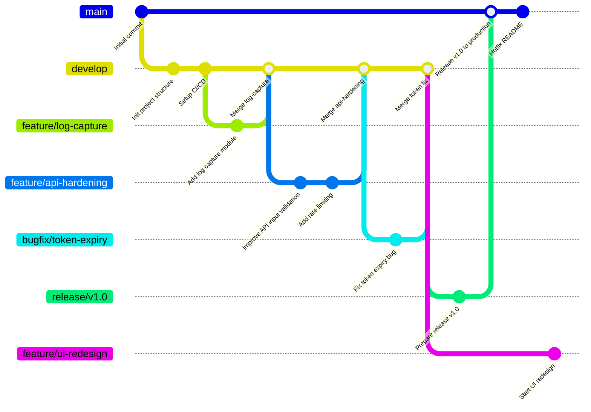

# Github Workflow


> "Behind every well-organized repo lies a story of purpose, experimentation, and constant iteration."

## About

After years of hands-on experience in cybersecurity and development, I’ve learned that code is just one part of the battle. The **structure** we build around our work — our process, our repository, our mindset — is what allows our projects to scale, evolve, and remain resilient.

This GitHub Page is more than just a collection of code — it's a reflection of my workflow, my evolution, and the systems I’ve put in place to stay adaptable in a fast-changing world.

## Architecture

To give you a better idea of how I separate concerns and automate deployments, here's a simplified view of the repository workflow

Each directory, file, and branch serves a purpose. Here’s a high-level overview of how my main repository is structured:



## Branch

I follow a Git Flow-inspired model because it enforces discipline in collaborative work.
It allows features, hotfixes, and releases to evolve in parallel, with clear boundaries and responsibilities

Maintaining a clean and sustainable workflow is key in collaborative and long-term projects. Here’s the branching model I follow:

- **`main`** – The **production** branch. Only stable, reviewed, and tested code lives here.
- **`develop`** – The **integration** branch for ongoing development. Features are merged here after review and testing.
- **`feature/*`** – Used for individual feature development (e.g., `feature/log-capture`, `feature/api-hardening`).
- **`bugfix/*`** – Quick patches or specific bug resolutions.
- **`release/*`** – For preparing stable releases, including documentation and final testing.

This structure allows me to stay agile while ensuring quality and traceability in the work I deliver.



## Automation

This repository follows a customized Git Flow strategy using helper shell scripts to simplify and streamline branch management, releases, and cleanup via the GitHub CLI.

> [!IMPORTANT]
> Before running any scripts, make sure you are in the root directory of the project. You’ll also need to have Git installed on your machine, as well as the [GitHub CLI (`gh`)](https://cli.github.com/). Ensure that `gh` is authenticated by running `gh auth login` if you haven’t already.

### Script Overview

| Script                | Purpose                                                  |
|----------------------|----------------------------------------------------------|
| `github-branch.sh`   | Create a branch (`feature/`, `bugfix/`, `hotfix/`, `release/`) and optionally open a pull request |
| `github-deploy`      | Prepare and merge a release branch into `main`, then sync with `develop` |
| `github-merged.sh`   | Clean up a merged branch locally and remotely            |

> [!NOTE]
> All scripts used to automate and simplify the Git workflow are stored in the `.shell/` directory at the root of the project.
> This dedicated folder centralizes all shell scripts related to branch management, deployment, and cleanup tasks, making it easier to maintain and update the automation tools.
> By keeping these scripts organized in one place, you can quickly locate, modify, or extend the workflow helpers as needed, ensuring a clean and manageable project structure.

### Usage

#### Create a Branch (Feature, Bugfix, etc.)

```bash
./.shell/github-branch.sh
```

You will be prompted to:

- Choose the branch type:
  - `feature/`
  - `bugfix/`
  - `hotfix/`
  - `release/`
- Enter a descriptive name (e.g., `fix-login-error`)
- Decide whether to push and create a Pull Request (PR) right away

The script will:

- Checkout the correct base branch (`main` or `develop`)
- Create and switch to the new branch
- Optionally push and open a PR via GitHub CLI

#### Deploy a Release

```bash
./.scripts/github-deploy
```

This script helps with the release process:

1. Create a `release/x.y.z` branch from `develop`
2. Wait for you to finalize and commit all changes
3. Push and open a PR into `main`
4. After confirming merge, it:
   - Updates `main`
   - Merges `main` back into `develop`
   - Pushes changes

#### Clean Up Merged Branches

```bash
./.scripts/github-merged.sh
```

Once your Pull Request has been merged on GitHub:

- Run this script **from the feature/hotfix/release branch**
- It will:
  - Confirm you’re on a non-protected branch
  - Switch to `main` or `develop`
  - Delete the merged branch locally and remotely

> [!NOTE]
> Protected branches such as `main` and `develop` are safeguarded by repository settings to prevent accidental deletion or force-pushes. For this reason, the cleanup script will **not** allow you to delete these branches locally or remotely. This ensures the stability and integrity of your main development and production branches throughout your workflow.

### Branch Protection (Recommended GitHub Settings)

Enable protection rules on:

- `main`
- `develop`

With:

- Require pull request reviews before merging
- Require status checks (if you have CI)
- Prevent force pushes

### Example Workflow

```bash
# Start a new feature
./.shell/github-branch.sh

# Work, commit, push, and open PR

# After merge:
./.shell/github-merged.sh

# For release:
./.shell/github-deploy
```

> [!TIP]
> For easier and quicker access to the Git Flow helper scripts, you can create shell aliases by adding the following lines to your shell configuration file (e.g., `.bashrc` or `.zshrc`):

```bash
alias gitflow-branch="./.shell/github-branch.sh"
alias gitflow-deploy="./.shell/github-deploy"
alias gitflow-clean="./.shell/github-merged.sh"
```

Then simply run:

```bash
gitflow-branch
gitflow-deploy
gitflow-clean
```



<!--

-->

---

> Author: [ProxyGeek](https://github.com/Pr0xyG33k)  
> URL: https://Pr0xyG33k.github.io/posts/github/  

