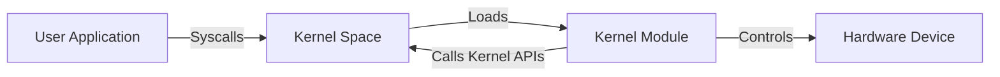

# Linux Kernel Exploitation Part 1


## About

In this first part of our Linux Kernel Exploitation series, we’ll lay down the essential knowledge needed to understand what the Linux kernel is, why it matters in security, and how vulnerabilities at this low level can impact entire systems.

The Linux kernel is the core component that manages hardware, processes, memory, and system resources. It acts as the critical bridge between software applications and the physical machine. Because it runs with the highest privileges, any flaw or exploit within the kernel can give attackers full control over a system.

Understanding kernel exploitation is a complex but rewarding journey. It requires a solid grasp of operating system internals, memory management, system calls, and security mechanisms.

> [!CAUTION]
> **Ethical Hacking Reminder**: Only perform kernel penetration tests on networks you own or have explicit permission to test. Unauthorized hacking is illegal and unethical.

## Linux Kernel Exploitation

In today’s computing landscape, the Linux kernel stands at the heart of countless systems — from personal computers and servers to cloud infrastructures and embedded devices. It manages critical functions like memory, processes, and hardware communication, silently powering the technology we rely on every day.

But have you ever wondered how this complex piece of software actually works under the hood? What happens when vulnerabilities arise deep within the kernel, and how can attackers leverage them to gain control over entire systems?

In this series, **Linux Kernel Exploitation** we will delve into the core of the Linux operating system, uncovering how the kernel operates, how security mechanisms protect it, and how these protections can sometimes be bypassed. We’ll explore practical techniques for setting up a controlled lab environment, analyzing kernel behavior, and developing exploits—all while building a strong foundation of understanding.

## What is the Linux Kernel?

The Linux kernel is the core component of the Linux operating system. It acts as a bridge between software applications and the physical hardware of a computer. Managing everything from CPU scheduling and memory allocation to device communication and system security, the kernel ensures that all parts of the system work together seamlessly.

Because it operates with the highest level of privilege on the machine (ring 0), the kernel has complete control over the system’s resources and hardware. This central role makes it both incredibly powerful and a critical target for attackers.

## Key Concepts

Before diving into exploitation, it’s essential to understand some key aspects of the Linux kernel. These foundational concepts help explain why the kernel is such a powerful — and attractive — target.

| Concept               | Description                                                                                   |
|-----------------------|-----------------------------------------------------------------------------------------------|
| Privilege Levels      | The kernel runs in **ring 0**, with full access to hardware and memory. User applications run in **ring 3**. |
| Monolithic Architecture | Linux uses a monolithic kernel, meaning it includes device drivers and modules within the kernel space. |
| Syscalls              | System calls are the interface between user applications and the kernel (e.g., `read()`, `write()`). |
| Kernel Space vs User Space | Separation between kernel memory and user memory helps maintain system stability and security.         |
| Memory Management     | The kernel controls virtual memory, paging, and physical memory allocation.                  |
| Modules               | Kernel modules are pieces of code that can be dynamically loaded into the kernel (e.g., drivers). |
| Scheduling            | Responsible for task switching, process priorities, and CPU time allocation.                  |
| Filesystem Interface  | The kernel manages filesystems and interacts with storage devices.                            |

These components are often the basis for real-world vulnerabilities, such as buffer overflows in device drivers or misconfigurations in syscall implementations.

## Evolution

Linux has evolved dramatically since its first release in 1991. With each new version, features, performance, and security mechanisms have been improved — but so have the opportunities for discovering bugs.

| Year | Kernel Version | Key Features Introduced                                                                 |
|------|----------------|------------------------------------------------------------------------------------------|
| 1991 | 0.01           | First public release by Linus Torvalds                                                   |
| 2001 | 2.4.x          | Netfilter/iptables, improved USB support, enhanced memory management                     |
| 2003 | 2.6.x          | Kernel preemption, Native POSIX threads, SELinux integration                            |
| 2011 | 3.x            | Improved scalability, transparent huge pages, Btrfs improvements                         |
| 2015 | 4.x            | Live patching, better NUMA support, perf events framework                               |
| 2020 | 5.x            | WireGuard VPN integration, io_uring, improved hardware support                           |
| 2024 | 6.x            | Ongoing enhancements to Rust support, memory isolation features, more secure syscall filtering |

> [!NOTE]
> Even as security mechanisms improve, new vulnerabilities continue to emerge — especially in device drivers and legacy code that hasn’t aged well.

## Basic Terms

### Security Mechanisms

Modern Linux kernels implement multiple layers of defense to make exploitation harder. Understanding these is crucial to learning how attackers bypass them.

| Mechanism         | Description                                                                                          | Mitigation Strength (0-10) |
|-------------------|----------------------------------------------------------------------------------------------------|----------------------------|
| **KASLR**         | Randomizes kernel memory layout to prevent predictable memory addresses.                            | 8                          |
| **SMEP/SMAP**     | Prevents kernel from executing or accessing user-space memory.                                     | 9                          |
| **Stack Canaries**| Detects and prevents stack buffer overflow attacks by checking integrity before function return.   | 7                          |
| **NX (No-eXecute)**| Marks memory regions non-executable to prevent code injection attacks.                            | 8                          |
| **Seccomp**       | Restricts system calls allowed for processes, reducing attack surface.                             | 6                          |
| **AppArmor/SELinux**| Mandatory Access Control enforcing strict policies on program capabilities.                      | 5                          |

In the upcoming parts, we'll study how these protections work — and how to defeat or bypass them when developing kernel exploits.

```echarts {js=true}
{
  title: {
    text: 'Kernel Defense Mechanisms Overview',
    left: 'center',
    top: '2%'
  },
  tooltip: { trigger: 'item' },
  radar: {
    indicator: [
      { name: 'KASLR', max: 10 },
      { name: 'SMEP/SMAP', max: 10 },
      { name: 'Stack Canaries', max: 10 },
      { name: 'NX', max: 10 },
      { name: 'Seccomp', max: 10 },
      { name: 'AppArmor/SELinux', max: 10 }
    ],
    radius: '60%',
    splitNumber: 4
  },
  series: [{
    name: 'Kernel Defenses',
    type: 'radar',
    data: [{
      value: [8, 9, 7, 8, 6, 5],
      name: 'Mitigation Strength',
      lineStyle: { color: '#66CFFF' },
      itemStyle: { color: '#66CFFF' },
      areaStyle: { color: 'rgba(102,207,255,0.3)' }
    }]
  }]
}

```

### User Space vs Kernel Space

Linux divides system memory into two distinct areas to ensure security and stability:

- **User Space**: This is where regular applications run—web browsers, editors, scripts, and so on. Programs in user space have limited access to system resources and cannot interact directly with hardware or critical kernel data. This isolation helps prevent accidental or malicious damage to the system.

- **Kernel Space**: This is where the Linux kernel operates, with full control over hardware, memory management, process scheduling, device drivers, and system security. Kernel code runs with the highest privileges (called **ring 0**), allowing unrestricted access to all system resources.

This separation between user and kernel spaces is vital. When a user program needs to perform an operation requiring elevated privileges—like reading a file or sending network data—it must communicate with the kernel through a controlled interface called a **system call**.

> [!NOTE]
> The Linux kernel runs in **ring 0**, which is the most privileged CPU mode. All user programs run in **ring 3**, with limited access.

### What is a System Call?

A **system call (syscall)** is a controlled gateway for user-space programs to request services from the kernel. It acts as a safe bridge between restricted applications and the privileged kernel.

When a syscall is invoked, the CPU switches from user mode (**ring 3**) to kernel mode (**ring 0**). The kernel then executes the requested operation—such as opening a file, allocating memory, or sending data—and finally returns control back to the user program.

Common examples of syscalls include `read()`, `write()`, `open()`, and `mmap()`.

This mechanism is critical because it maintains system stability and security while still allowing user applications to perform necessary tasks.

### Kernel Memory Layout

The Linux kernel’s memory is organized into several segments, each serving a different purpose:

| Segment        | Description                                                   |
|----------------|---------------------------------------------------------------|
| **Text (code)** | Contains the executable instructions of the kernel itself     |
| **Data**       | Holds global variables and static data, both initialized and uninitialized |
| **Heap**       | Area used for dynamic memory allocations within the kernel     |
| **Stack**      | Used for per-thread function calls, local variables, and return addresses |

To increase security, modern kernels implement protections like **Kernel Address Space Layout Randomization (KASLR)**, which randomizes the locations of these memory segments at boot time. This makes it much harder for attackers to predict where critical kernel code or data reside, complicating exploitation attempts.

The text segment holds executable code and is often targeted for code injection or modification. The data and heap segments are frequent targets for overflow or corruption attacks. The stack is critical for control flow and vulnerable to buffer overflows and return-oriented programming (ROP) attacks.

### Common Kernel Vulnerabilities

The kernel, despite its protections, can have bugs that lead to vulnerabilities. Some of the most common types include:

| Vulnerability      | Description                                                                                      |
|--------------------|------------------------------------------------------------------------------------------------|
| **Buffer Overflow** | Occurs when data is written beyond the bounds of a buffer, potentially overwriting important control data or code pointers. This can lead to arbitrary code execution. |
| **Use-After-Free**  | Happens when the kernel accesses memory that has already been freed, leading to undefined behavior or exploitation opportunities. |
| **Race Conditions** | Arise when multiple threads or processes access shared resources simultaneously, causing inconsistent or unexpected states that attackers can exploit. |
| **Integer Overflows** | Errors in arithmetic calculations can result in incorrect memory size computations, leading to memory corruption or buffer overflows. |

Understanding these vulnerabilities is key to developing kernel exploits and also to designing better defenses.

### Kernel Modules

Kernel modules are pieces of code—often device drivers or filesystem drivers—that can be dynamically loaded and unloaded into the kernel at runtime.

Since modules run with full kernel privileges, any flaw or bug in their code can directly compromise the entire system. Poorly written or malicious modules are frequent sources of kernel vulnerabilities and exploitation vectors.



### Exploit Development Workflow

Developing a kernel exploit typically follows a multi-step process:

1. **Vulnerability Discovery**  
   Finding bugs via code auditing, fuzzing, or analyzing kernel crash reports.

2. **Proof of Concept (PoC)**  
   Creating a minimal piece of code that reliably triggers the vulnerability to confirm its existence.

3. **Exploit Development**  
   Crafting a payload that leverages the bug to escalate privileges, usually from user space (ring 3) to kernel space (ring 0).

4. **Bypassing Protections**  
   Implementing techniques to circumvent kernel defenses such as KASLR, SMEP/SMAP (Supervisor Mode Execution/Access Prevention), and stack canaries.

5. **Payload Execution**  
   Running the final payload with kernel-level privileges to achieve goals like root shell access or kernel memory manipulation.

#### Stack & Heap

- **Stack**: Used for managing function calls and local variables. Vulnerabilities like stack buffer overflows are common.
- **Heap**: A dynamic memory region for allocating objects at runtime. Heap corruption is another common exploitation vector.

#### Device Driver

A **device driver** is kernel code that allows the OS to interface with hardware (e.g., network cards, USB devices). Poorly written drivers are a **frequent source of kernel vulnerabilities**.

#### Context Switch

A **context switch** occurs when the CPU changes from executing one process to another. The kernel is responsible for this operation, and it involves saving and restoring process states.

## Conclusion

In this first part, we explored the foundational concepts of the Linux kernel, its memory layout, key defense mechanisms, and common vulnerabilities that affect this critical part of the system.

Understanding these basics is essential for anyone looking to dive into kernel exploitation, as they shape how attacks are crafted and defenses bypassed.

In the upcoming parts, we will dive into practical exploitation examples, setting up a safe testing environment, and techniques to analyze and circumvent kernel protections.

---

> Author: [ProxyGeek](https://github.com/Pr0xyG33k)  
> URL: https://Pr0xyG33k.github.io/posts/kernel01/  

