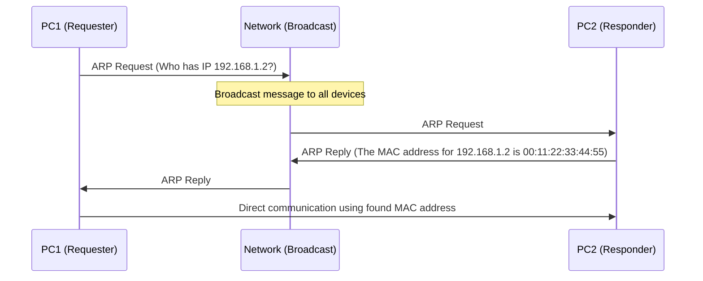
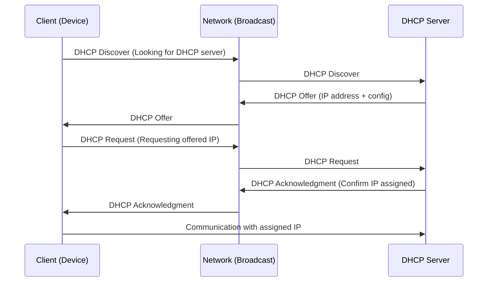

# Wireless Hacking Part 1


## About

In this blog, we have introduced the basics of wireless hacking to lay the groundwork for understanding how wireless networks function and the security challenges they present. We began by discussing the fundamental concepts of WiFi, including its evolution, how it enables wireless communication, and the crucial terminology used in the realm of wireless networking.

Additionally, we explored the history of WiFi—from its early days as a simple communication medium to its widespread adoption in homes, businesses, and public spaces. Understanding this evolution provides us with context for the vulnerabilities that exist in modern wireless systems today.

_Join us for an engaging journey that combines learning, awareness, and securing our wireless connections._

> [!CAUTION]
> **Ethical Hacking Reminder**: Only perform wireless penetration tests on networks you own or have explicit permission to test. Unauthorized hacking is illegal and unethical.

## Wireless Hacking

In today’s world, **Wi-Fi** is ubiquitous, powering the internet connection for our devices and enabling seamless communication and access to information. But have you ever stopped to wonder how Wi-Fi actually works beneath the surface? Is it possible to **manipulate wireless networks** for various purposes? In this series, **"Guide to Wireless Hacking,"** we will explore the inner workings of Wi-Fi networks, uncover their **vulnerabilities**, and learn how these weaknesses can be exploited.

In this first blog post, we will start with the **fundamentals**. We’ll explore how Wi-Fi networks operate, define essential networking terms, and take a look at the **history** and key characteristics of Wi-Fi technology.

## What is Wi-Fi?

**Wi-Fi**, which stands for Wireless Fidelity, is a wireless technology that enables devices to **connect to the internet** or communicate with each other without using physical cables. It relies on **radio waves** to transmit data, which allows it to function in areas where it’s not possible to run traditional cables.

Wi-Fi is the primary method of internet connectivity in **homes** and **businesses**. It’s also widely available in **public spaces** such as cafés, libraries, and airports.

## Key Features

| **Feature**             | **Description**    |
|-------------------------|--------------------|
| **Wireless Connectivity** | Wi-Fi eliminates the need for cables, allowing you to connect your devices wirelessly to the internet. |
| **Portability**           | As a wireless technology, Wi-Fi enables you to easily take your devices and connect to available Wi-Fi networks wherever you go. |
| **Speed**                 | Over time, Wi-Fi speeds have steadily improved, and today’s networks can match or even surpass wired connections in terms of performance. |
| **Security**              | Wi-Fi networks can be secured using several encryption methods, including WPA2 and WPA3, to ensure privacy and data protection. |
| **Wide Compatibility**    | Wi-Fi is widely supported, and nearly all modern devices come with built-in Wi-Fi adapters. |
| **Range**                 | Wi-Fi coverage varies depending on the network’s frequency (2.4 GHz vs 5 GHz) and environmental factors. Generally, 2.4 GHz offers a broader range but lower speeds than 5 GHz networks. |
| **Obstacle**           | Wi-Fi signals can travel through walls and other obstacles, but the signal strength decreases as it passes through materials. |
| **Interference**          | Wi-Fi networks can be disrupted by other electronic devices, such as microwaves and cordless phones, causing signal degradation. |
| **Security Risks**        | While various security protocols help protect Wi-Fi networks, no system is completely immune to hacking attempts. |

## The Technology Behind

Wi-Fi operates based on the principles of radio wave transmission and modulation. This allows devices to communicate wirelessly and transfer data. The technology is built on the IEEE 802.11 family of standards, which outline the specifications and protocols used for wireless local area networks (WLANs).

> [!NOTE]
> **The IEEE (Institute of Electrical and Electronics Engineers)** is an international organization that creates technical standards for various fields of engineering.

## The Evolution

Wi-Fi technology was developed through the combined efforts of various organizations and researchers. The IEEE 802.11 working group established the technical standards that define Wi-Fi, with input from multiple stakeholders in the industry. Key factors such as the availability of unlicensed spectrum and advancements in wireless communication technologies were instrumental in its growth. The Wi-Fi Alliance plays a pivotal role in ensuring device compatibility and managing certification programs. Over the years, Wi-Fi has evolved through several versions, including 802.11b, 802.11g, 802.11n, 802.11ac (Wi-Fi 5), and 802.11ax (Wi-Fi 6), each offering improvements in speed, coverage, and efficiency.

| Year | Standard              | Data Rate         | Frequency Band         | Key Features                                                                 |
|------|-----------------------|-------------------|-------------------------|------------------------------------------------------------------------------|
| 1997 | 802.11                | 2 Mbps            | 2.4 GHz                 | Original Wi-Fi standard for basic wireless LAN communication                 |
| 1999 | 802.11b               | 11 Mbps           | 2.4 GHz                 | Higher data rates, widely adopted in consumer markets                       |
| 1999 | Wi-Fi Alliance formed | -                 | -                       | Created to promote global Wi-Fi interoperability                            |
| 2003 | 802.11g               | 54 Mbps           | 2.4 GHz                 | Faster speeds, backward compatibility with 802.11b                          |
| 2004 | WPA                   | -                 | -                       | Introduced enhanced security features to fix WEP vulnerabilities            |
| 2006 | 802.11n               | Up to 600 Mbps    | 2.4 GHz and 5 GHz       | Introduced MIMO for better range and data rates                             |
| 2007 | WPA2                  | -                 | -                       | Successor to WPA with stronger encryption and enhancements                  |
| 2009 | Wi-Fi Direct          | -                 | 2.4 GHz and 5 GHz       | Allows device-to-device connection without an access point                  |
| 2012 | 802.11ac (Wi-Fi 5)    | Up to 6.9 Gbps    | 5 GHz                   | Improved performance, capacity, and speed                                   |
| 2013 | Hotspot 2.0           | -                 | -                       | Seamless authentication and roaming for public Wi-Fi                        |
| 2019 | 802.11ax (Wi-Fi 6)    | Up to 9.6 Gbps    | 2.4 GHz and 5 GHz       | Increased efficiency, reduced latency, better network capacity              |
| 2020 | Wi-Fi 6E              | Up to 9.6 Gbps    | 2.4 GHz, 5 GHz, 6 GHz   | Expanded Wi-Fi into the 6 GHz band for more bandwidth and less congestion   |

## Wireless security Protocols

Wireless security protocols are designed to protect wireless networks from unauthorized access, data breaches, and malicious activities. These protocols ensure the confidentiality, integrity, and authenticity of transmitted data.

| Protocol                      | Description                                                                 | Encryption Used                              | Safety Level | Developed In |
|------------------------------|-----------------------------------------------------------------------------|----------------------------------------------|--------------|--------------|
| WEP (Wired Equivalent Privacy)| The first wireless security protocol, providing basic Wi-Fi encryption     | RC4                                           | Low          | 1997         |
| WPA (Wi-Fi Protected Access) | Replacement for WEP, with stronger encryption and key management            | TKIP (Temporal Key Integrity Protocol)       | Moderate     | 2003         |
| WPS (Wi-Fi Protected Setup)  | Simplifies device connection process, but can be vulnerable if misused      | Varies (Depends on WPA/WPA2)                 | Varies       | 2006         |
| WPA2                         | Enhanced WPA with stronger AES encryption                                   | AES (Advanced Encryption Standard)           | High         | 2004         |
| WPA3                         | Latest standard, with improved encryption and security features over WPA2   | SAE (Simultaneous Authentication of Equals)  | Very High    | 2018         |

## Basic Terms

### WiFi Adaptor

A **Wi-Fi adapter**, also known as a **Wi-Fi dongle** or **wireless network adapter**, is a device that enables a computer or other devices to connect to a Wi-Fi network. It allows devices that do not have built-in Wi-Fi capabilities to access **wireless networks** and **connect to the internet** or communicate with other devices **wirelessly**.

> [!NOTE]
> If you want to use WIFI functionality in a virtual machine, you will have to use an external WIFI adaptor and will have configure it with VMware or Virtual box.

### AP (Access Point)

**AP** stands for **Access Point** in the context of Wi-Fi. An Access Point is a device that allows **Wi-Fi-enabled devices** to connect to a **wired network wirelessly**. It acts as a **central hub** or **gateway** for wireless communication, providing a **bridge** between Wi-Fi devices and a wired network.

### Frequency

**Frequency bands** refer to specific ranges of **radio frequencies** that are used for wireless communication. Wi-Fi operates in two main frequency bands: **2.4 GHz** and **5 GHz**.

- **2.4 GHz**: The 2.4 GHz band is the older and more widely used frequency band in Wi-Fi. It provides good coverage and can obstacles like walls more effectively.
- **5 GHz**: The 5 GHz band is a newer addition to Wi-Fi and offers more available channels with wider frequency ranges. It provides faster data speeds and is less congested compared to the 2.4 GHz band since fewer devices operate in this range. However, the 5 GHz signals have a shorter range and may encounter more attenuation when passing through walls and other obstacles.

```echarts {js=true}
{
  color: ['#00BFFF', '#FF7F50'],
  title: {
    text: 'Wi-Fi Frequency Bands Overview',
    top: '2%',
    left: 'center'
  },
  tooltip: {
    trigger: 'axis',
    axisPointer: {
      type: 'shadow',
      label: {
        backgroundColor: '#6a7985'
      }
    },
    formatter: function(params) {
      const defs = {
        "Coverage": "Area where the Wi-Fi signal can be effectively received.",
        "Channels": "Number of available channels for data transmission.",
        "Speed": "Maximum theoretical data transmission speed.",
        "Obstacle": "Ability of the signal to pass through walls and obstacles.",
        "Congestion": "Level of interference caused by other devices.",
        "Connectivity": "Ease of connection without physical cables.",
        "Portability": "Ability to use Wi-Fi on mobile and portable devices.",
        "Security": "Level of data protection on the network (WPA2/WPA3).",
        "Compatibility": "Number of devices supporting this frequency band.",
        "Range": "Maximum distance at which the signal is usable.",
        "Interference": "Disturbances caused by other electronic devices."
      };
      let category = params[0].axisValue;
      let tooltipText = `<b>${category}</b><br>${defs[category]}<br><br>`;
      params.forEach(item => {
        tooltipText += `${item.marker} ${item.seriesName}: ${item.data}<br>`;
      });
      return tooltipText;
    }
  },
  legend: {
    data: ['2.4 GHz', '5 GHz'],
    top: '10%'
  },
  toolbox: {
    feature: {
      saveAsImage: {}
    }
  },
  grid: {
    left: '5%',
    right: '5%',
    bottom: '10%',
    top: '20%',
    containLabel: true
  },
  xAxis: {
    type: 'category',
    data: [
      "Coverage",
      "Channels",
      "Speed",
      "Obstacle",
      "Congestion",
      "Connectivity",
      "Portability",
      "Security",
      "Compatibility",
      "Range",
      "Interference"
    ],
    axisLine: { lineStyle: { color: '#888' } },
    axisTick: { alignWithLabel: true }
  },
  yAxis: {
    type: 'value',
    max: 10,
    axisLine: { lineStyle: { color: '#888' } },
    splitLine: { lineStyle: { type: 'dashed', color: '#ddd' } }
  },
  series: [
    {
      name: '2.4 GHz',
      type: 'bar',
      barGap: 0,
      barCategoryGap: '40%',
      emphasis: {
        focus: 'series'
      },
      data: [9, 3, 5, 8, 7, 10, 10, 7, 10, 9, 6],
      itemStyle: {
        color: 'rgb(0, 191, 255)'
      }
    },
    {
      name: '5 GHz',
      type: 'bar',
      emphasis: {
        focus: 'series'
      },
      data: [6, 9, 9, 5, 3, 10, 10, 9, 10, 6, 4],
      itemStyle: {
        color: 'rgb(255, 127, 80)'
      }
    }
  ]
}

```

### Channels

**Channels** refer to specific **frequencies** within the **wireless spectrum** that are used for **transmitting and receiving data**. Wi-Fi channels are **divided** to reduce **interference** and allow multiple networks to operate in **close proximity** without conflicting with each other.

> [!NOTE]
> Each frequency band is divided into multiple channels, represented by numbers. For example, in the 2.4 GHz band, there are 11 channels available, usually numbered from 1 to 11. In the 5 GHz band, there are typically more channels available, such as 24 or more.
> Channels in the 2.4 GHz band have a narrower frequency range and can partially overlap with each other. This means that neighboring Wi-Fi networks using nearby channels may experience interference, which can degrade the performance of both networks.

### ESSID

**ESSID** stands for **Extended Service Set Identifier**. It is the **name assigned to a Wi-Fi network**. The ESSID acts as a **unique identifier** that allows devices to **differentiate between different wireless networks** in the vicinity. When you search for available Wi-Fi networks on your device, you see a list of **ESSIDs** to choose from.

### BSSID

**BSSID** stands for **Basic Service Set Identifier**. It is a **unique identifier** assigned to each **wireless access point (AP)** in a Wi-Fi network. Each access point in a Wi-Fi network has its own **MAC (Media Access Control) address**, which is a **unique identifier** assigned to the **network interface** of the device. The BSSID is **derived from the MAC address** of the access point.

### Bandwidth

**Bandwidth** in Wi-Fi refers to the **maximum data transfer rate** or **capacity** of a wireless network. It represents the **amount of data** that can be transmitted over the network within a given time frame. Measured in **Gigabits per second (Gbps)** or **Megabits per second (Mbps)**.

### Key/Passphrase

A key refers to a cryptographic code or password used for authentication and encryption purposes to secure a wireless network

There are two keys when working with WIFI :

- **Network Security Key:** Also known as a Wi-Fi password or passphrase, the network security key is used to authenticate a client device and grant access to the Wi-Fi network. When connecting to a secured Wi-Fi network, users are typically prompted to enter the network security key to prove their authorization. This key is used during the authentication phase of the Wi-Fi handshake process to establish a secure connection.
- **Encryption Key:** Once a client device is authenticated and connected to a Wi-Fi network, an encryption key is used to encrypt and decrypt the data transmitted over the network. This key ensures that the data exchanged between the client and the access point is secure and cannot be intercepted or understood by unauthorized parties. Different encryption protocols, such as WPA2 or WPA3, use different encryption keys and algorithms to protect the confidentiality and integrity of the Wi-Fi communication.

## Some Neccessary Networking Concepts

### MAC Address

A **MAC address** (Media Access Control address) is a **unique identifier** assigned to **network interfaces**, such as network cards or Ethernet ports.  
It is a **48-bit** (6-byte) value expressed in **hexadecimal format**, typically written in pairs separated by colons or hyphens.  
Example: `00:1A:2B:3C:4D:5E` — the first half is the **Organizationally Unique Identifier (OUI)** (identifies the **manufacturer**), and the second half is the **device-specific identifier**.

### ARP

**ARP** stands for **Address Resolution Protocol**. It is used in networks to **map an IP address to a MAC address**.

When a device wants to communicate with another on the same network, it uses ARP to find the **MAC address** of the destination by sending an **ARP request**.



### IP Address

An **IP address** (Internet Protocol address) is a **numerical label** assigned to each device connected to a network.

It serves as a **unique identifier**, allowing devices to **send and receive data** over the internet or a private network.

### Gateway

A **gateway** is a device or system that serves as an **entry point** between different networks.

It **forwards data packets** based on their destination and enables **communication between networks**.

### Router

A **router** is a networking device that **connects multiple networks** and **routes traffic** between them.

It acts as a **central hub** and makes decisions based on the **destination address** of data packets.

### Subnet

A **subnet** (subnetwork) is a **logical division** of an IP network.

**Subnetting** improves **network performance**, **security**, and **organization** by separating broadcast domains.

### DHCP

**DHCP** (Dynamic Host Configuration Protocol) is responsible for **automatically assigning IP addresses** and other network settings to devices on a network.



### Working Of WIFI

- **Device Connection to the Network:** When a device (e.g., a computer, smartphone, or IoT device) connects to a network, it typically does so via a physical connection (e.g., Ethernet cable) or wirelessly through Wi-Fi. The device sends a request to join the network, and the network infrastructure, including the router, facilitates the connection.

- **Obtaining an IP Address:** Once connected, the device needs to obtain an IP address to communicate on the network. There are two main methods for IP address assignment: static and dynamic. In the case of dynamic IP address assignment, the device sends a request to the router using the DHCP protocol, which we discussed earlier. The router then assigns an available IP address from its pool and provides it to the device.

- **Local Network Communication:** With the assigned IP address, the device can now communicate with other devices on the local network. It can send data packets to other devices by addressing them using their IP addresses within the same network. This communication happens directly between devices within the network without involving the router.

- **Destination Outside the Local Network:** If the device wants to communicate with a destination outside the local network (e.g., a website or a server on the internet), it follows these steps:

#### Determining the Gateway

The device checks its **network configuration** and identifies the **default gateway**, which is the **IP address of the router**. The gateway acts as the **exit point** for traffic leaving the local network.

#### Data Routing

The device **encapsulates the data** it wants to send within **packets**. Each packet contains the **destination IP address**. When sent, the packets are forwarded to the **default gateway** (router).

#### Network Address Translation (NAT)

Upon receiving the packets, the router performs **Network Address Translation (NAT)**. It replaces the **source IP address** with its own **public IP address**, **hiding private IPs** of local devices. This ensures that **response packets** can return to the router.

#### Routing to the Internet

The router examines the **destination IP** and checks its **routing table** to find the **next-hop router** or **gateway**. It forwards the packets until they reach the **destination network** (e.g., the internet).

#### Public IP Communication

Response packets are routed back using the router’s **public IP address**. The router uses its **NAT records** to translate the **destination IP** back to the **private IP** of the originating device.

#### Delivery to the Device

The router **forwards the response packets** to the correct device on the **local network**. The device processes the data, enabling the user to **view webpages**, **receive emails**, or **use internet services**.

> [!NOTE]
> Each device on the network uses Router’s Public Ip address to communicate to the whole world.

### Wi-Fi Adapter Operation Modes

Wi-Fi adapters can function in various **modes**, depending on their features and configuration. These modes define how the adapter handles the **transmission and reception** of wireless signals.

#### Infrastructure (Managed) Mode

This is the **standard mode** for most Wi-Fi adapters. In infrastructure mode, the adapter **connects to a wireless router or access point** to join an existing network. It enables the device to **access the internet** and **communicate with other devices** within the same network.

#### Soft Access Point (Soft AP) Mode

Some adapters support **Soft AP mode**, which allows them to act as **virtual access points**. In this configuration, the adapter **creates its own wireless network**, letting other devices **connect to it**. Useful for **sharing an internet connection** or setting up a **temporary local network**.

#### Monitor Mode

**Monitor mode** allows the adapter to **passively capture all wireless signals** in range **without joining a network**. It’s used for **analyzing wireless traffic**, **network diagnostics**, or **packet sniffing** for **security** or **troubleshooting**.

#### Promiscuous Mode

While similar to monitor mode, **promiscuous mode** focuses on **capturing all traffic** the adapter can receive, **regardless of destination**. It is used in **network analysis** and **security assessments** to inspect and study **data packets** for **anomalies** or **threats**.

> [!NOTE]
> All of the above-mentioned modes are not available in all WIFI adaptors, there are only specific WIFI adaptors in the market that supports modes other than managed mode. So to fully learn from these series you will have to get an adaptor which these modes

There is a list of WIFI adaptors from which you can choose:

- [Alfa AC1900 WiFi Adapter](https://www.amazon.com/dp/B01MZD7Z76)
- [Alfa Long-Range Dual-Band AC1200 Wireless USB 3.0](https://www.amazon.com/dp/B00VEEBOPG)
- [TP-Link Nano USB Wifi Dongle 150Mbps High Gain Wireless Network Adapter](https://www.amazon.fr/dp/B002SZEOLG)
- [TRENDnet AC1900 High Power Dual Band Wireless USB Adapter](https://www.amazon.com/dp/B01EOQ61KI)
- [Alfa AWUS036NHA](https://www.getic.fr/product/alfa-awus036nha)
- [Panda Wireless® Mid Range 150Mbps](https://www.amazon.com/dp/B004AC0L4Y)

## Conclusion

In this first part of our wireless hacking series, we’ve laid the foundation for understanding how Wi-Fi networks work, covering the fundamental concepts, essential terms, and the history behind the technology. Understanding these basics is key to mastering more advanced topics like network security, encryption protocols, and wireless attacks.

As we move forward, we’ll dive deeper into practical techniques and tools that will help us secure and audit wireless networks. In the next part, we’ll set up a safe, isolated testing environment to begin experimenting with attacks, allowing us to learn by doing.


---

> Author: [ProxyGeek](https://github.com/Pr0xyG33k)  
> URL: https://Pr0xyG33k.github.io/posts/wireless01/  

