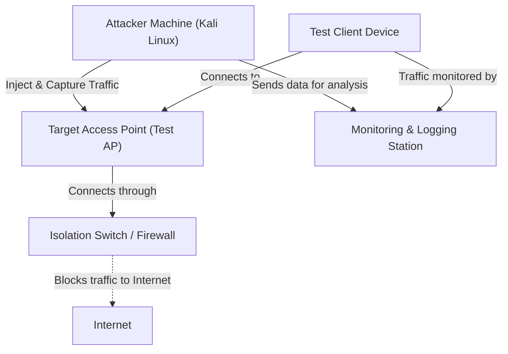

# Wireless Hacking Part 2


## About

In Part 2 of our Wireless Hacking series, we shift our focus from theory to practice.
Having explored the fundamental concepts of wireless networks and security in the first part of this series, it's now time to transition from theoretical knowledge to hands-on experience. While understanding the theory behind wireless attacks is essential, practical skills are just as important in mastering wireless security. However, before we begin exploring the world of wireless hacking and penetration testing, it's critical to create a safe and controlled environment in which to learn

> [!CAUTION]
> **Ethical Hacking Reminder**: Only perform wireless penetration tests on networks you own or have explicit permission to test. Unauthorized hacking is illegal and unethical.

## Environment

Before performing any wireless attacks or experiments, it's crucial to set up a safe and isolated testing environment. Here are two solid options depending on your setup and preferences:

### Option 1: Installing Kali Linux on a Virtual Machine

**Recommended software**: [VirtualBox](https://www.virtualbox.org/) or [VMware Workstation Player](https://www.vmware.com/products/workstation-player.html) (free for personal use) or [QEMU/KVM](https://www.qemu.org/download/).

#### Option 1 Downloads Links

- [Kali Linux Virtual Machines Image](https://www.kali.org/get-kali/#kali-virtual-machines)
- [Kali Linux ISO Image](https://www.kali.org/get-kali/#kali-installer-images)

#### Option 1 Installation Steps

- Make sure virtualization (Intel VT or AMD-V) is enabled in your computer’s BIOS/UEFI settings.
- Allocate at least **2 GB of RAM** and **20 GB of disk space**.
- Set the network adapter to **"Bridged Adapter"** to give Kali access to your local network.
- Use a **USB Wi-Fi adapter that supports monitor mode**, and pass it through to the VM.

---

### Option 2: Installing Kali Linux on a Raspberry Pi

**Required hardware**:

- Raspberry Pi 4
- MicroSD card (minimum 16 GB)
- Power supply, keyboard, mouse, and HDMI screen

#### Option 2 Downloads Links

- [Kali Linux ARM image for Raspberry Pi](https://www.kali.org/get-kali/#kali-arm)

#### Option 2 Installations Steps

1. Use [Raspberry Pi Imager](https://www.raspberrypi.org/software/) or a similar tool to flash the Kali image onto the microSD card.
2. Insert the card into the Raspberry Pi, connect all peripherals, and boot it up.
3. Follow the on-screen setup instructions and ensure your Wi-Fi adapter is compatible with monitor mode.

## Architecture

The architecture of a Wi-Fi hacking lab is designed to create a controlled environment for safely testing wireless security. At the core of the lab is the Attacker Machine (Kali Linux), which runs penetration testing tools to perform attacks on the Target Access Point (Test AP). The Test Client Device connects to the AP, simulating a user’s interaction with the network. The Isolation Switch/Firewall ensures the lab is separated from the wider network and blocks unauthorized internet access, protecting the external network from any potential disruption. Finally, the Monitoring & Logging Station captures and analyzes the traffic between the attacker, the AP, and the client, allowing for detailed analysis and logging of all actions. This setup ensures that wireless security testing can be performed safely and ethically within an isolated environment.



## Checksum

> [!WARNING]
> Before proceeding with creating the virtual machine, it's strongly recommended to **verify the SHA256 checksum** of the Kali Linux ISO. This helps ensure that the file has not been corrupted during download or maliciously altered. Verifying the checksum is an important security step to ensure the integrity of the ISO file, especially when downloading from the internet. Without this verification, you could be running a compromised version of Kali Linux, which could expose your system to unnecessary risks.

Here’s how you can verify the checksum and ensure that the ISO is safe to use:

```bash
#!/bin/bash

set -e

VERSION="2025.1c"
BASE_URL="https://cdimage.kali.org/kali-$VERSION"
ISO="kali-linux-$VERSION-installer-amd64.iso"

echo "Creating download directory..."
mkdir -p ~/Downloads/iso/kali-$VERSION
cd ~/Downloads/iso/kali-$VERSION

echo "Downloading Kali Linux ISO and verification files..."
wget -q --show-progress "$BASE_URL/$ISO"
wget -q --show-progress "$BASE_URL/SHA256SUMS"
wget -q --show-progress "$BASE_URL/SHA256SUMS.gpg"

echo "Importing Kali Linux official GPG key..."
gpg --keyserver hkps://keyserver.ubuntu.com --recv-keys 44C6513A8E4FB3D30875F758ED444FF07D8D0BF6

echo "Verifying SHA256SUMS signature..."
gpg --verify SHA256SUMS.gpg SHA256SUMS

echo "Verifying ISO checksum..."
sha256sum -c SHA256SUMS 2>/dev/null | grep "$ISO"

echo "All done! If you see '$ISO: OK' above, your ISO is verified and safe to use."
```

```output
Creating download directory...
Downloading Kali Linux ISO and verification files...
kali-linux-2025.1c-installer 100%[===========================================>]   4.13G   107MB/s    in 41s     
SHA256SUMS                   100%[===========================================>]   2.80K  --.-KB/s    in 0s      
SHA256SUMS.gpg               100%[===========================================>]     833  --.-KB/s    in 0s      
Importing Kali Linux official GPG key...
gpg: key ED444FF07D8D0BF6: 2 duplicate signatures removed
gpg: key ED444FF07D8D0BF6: "Kali Linux Repository <devel@kali.org>" not changed
gpg: Total number processed: 1
gpg:              unchanged: 1
Verifying SHA256SUMS signature...
gpg: Signature made Thu 24 Apr 2025 05:31:10 AM CEST
gpg:                using RSA key 827C8569F2518CC677FECA1AED65462EC8D5E4C5
gpg: checking the trustdb
gpg: marginals needed: 3  completes needed: 1  trust model: pgp
gpg: depth: 0  valid:   2  signed:   0  trust: 0-, 0q, 0n, 0m, 0f, 2u
gpg: next trustdb check due at 2028-04-17
gpg: Good signature from "Kali Linux Archive Automatic Signing Key (2025) <devel@kali.org>" [ultimate]
Verifying ISO checksum...
kali-linux-2025.1c-installer-amd64.iso: OK
kali-linux-2025.1c-installer-amd64.iso.torrent: FAILED open or read
All done! If you see 'kali-linux-2025.1c-installer-amd64.iso: OK' above, your ISO is verified and safe to use.
```

## VMware Workstation

To begin, open **VMware Workstation** on your system. This graphical tool will allow you to easily manage virtual machines. Once the application is open, click on the **"Create a New Virtual Machine"** button.

In the wizard that appears, select **"Installer disc image file (iso)"** and browse to the **Kali Linux ISO** you previously downloaded. Next, choose the OS type as **Linux**, and for the version, select **Debian 10.x 64-bit**—this works well for Kali Linux.

<div style="display: flex; justify-content: space-between;">
  
  
</div>

You’ll then be prompted to assign system resources to the VM. It is recommended to allocate **at least 2GB of RAM**, but **4GB (4096MB)** is ideal if your host machine allows it. You should also assign **2 or more CPU cores** to ensure smooth performance. After this, you’ll create a virtual hard disk—make sure it is **at least 20GB**, and **dynamically allocated** to save space.

Once these steps are complete, click **Finish** to create and launch the virtual machine.

### Configuration

Before installing Kali, a few adjustments to the virtual hardware settings are necessary. In VMware Workstation, select your newly created Kali VM and click Edit Virtual Machine Settings to access its configuration panel.

Inside this panel, make sure that the Kali Linux ISO is correctly attached as the boot media under the CD/DVD section. Next, review the network settings. By default, the network is set to NAT, which provides Internet access through your host. However, if you want the VM to be visible on your local network (useful for advanced testing), you can change it to Bridged mode and select your host interface.

Finally, ensure that a USB controller (either USB 2.0 or 3.0) is present and enabled in the settings. This will be important later when attaching a USB Wi-Fi adapter.

### Installation

Now that your VM is ready, start it up. The system should boot directly into the Kali Linux ISO. On the boot menu, select "Graphical Install" to launch the graphical installer, which is easier for most users to navigate.

Proceed through the installation by choosing your language, country, and keyboard layout. You’ll then configure your network settings, including a hostname (e.g., kali-vm) and an optional domain name. After that, create a user account and password. Kali now defaults to a non-root user, which improves security and mirrors real-world Linux use.

For disk setup, select Guided - use entire disk, which is the simplest and safest option for a VM. Confirm your partitioning choices and let the installer complete the process. Once installation is finished, remove the ISO from the virtual CD-ROM and reboot the VM.

### Settings

If you plan to use tools that require raw access to a wireless interface, such as aircrack-ng or bettercap, you’ll need to passthrough a USB Wi-Fi adapter that supports monitor mode and packet injection.
The first step is to install the necessary packages that will allow Kali to build the driver for your USB Wi-Fi adapter

The driver you’re installing, `8814au`, is designed for Wi-Fi cards that use the **Realtek RTL8814AU chipset**. Before proceeding, it’s crucial to verify that your Wi-Fi card uses this chipset, as the driver will only work with compatible hardware [ALFA Network RTL8814AU Linux Driver Support](https://docs.alfa.com.tw/Support/Linux/RTL8814AU/).

To check your Wi-Fi card’s chipset, you can use the `lsusb` or `lspci` command in your terminal (depending on whether it’s a USB or PCI card).

```bash
┌──(proxygeek㉿VMware-kali)-[~]
└─$ sudo apt install -y linux-headers-$(uname -r) build-essential bc dkms git libelf-dev rfkill iw
```

> [!NOTE]
> If you encounter an error while installing the dependencies, make sure your system is up to date by running `sudo apt update && sudo apt upgrade`. If the issue persists, check that your Linux kernel is compatible with the `linux-headers` package you installed.

To do this, plug your adapter into the host machine. Then, with the Kali VM powered off, open Edit Virtual Machine Settings. Click Add and choose USB Controller, then select USB Device and pick your USB Wi-Fi adapter from the list.

<div style="display: flex; justify-content: center;">
  
</div>

The first task is to prepare a location on your system where the downloaded driver files will be stored. This is important to keep everything organized and ensure that the installation files are easily accessible. To create the directory, you will use the `mkdir` command, which stands for "make directory." The `-p` flag ensures that if the directory does not already exist, it will be created. The directory we will create is called `src`, and it will be placed in your home directory (`~/`), which is a standard practice for organizing source files.

After running this command, you’ll have a new folder named `src` in your home directory. This folder will be used specifically for storing the driver files that you will download in later steps.

Now that you're in the correct directory, it's time to download the driver. In this case, the driver files are hosted on GitHub, a popular platform for sharing and collaborating on code. The easiest way to get the driver is by cloning the GitHub repository that contains it. To clone a repository, you use the `git clone` command, which will create a local copy of the repository on your system. The repository we’re using is hosted at `https://github.com/morrownr/8814au.git`. This repository contains the necessary files to install the driver for your device.

```bash
┌──(proxygeek㉿VMware-kali)-[~]
└─$ git clone https://github.com/morrownr/8814au.git
```

The installation process is handled by a script named `install-driver.sh`. Running this script will compile and install the necessary files to get the driver working on your system. There are two ways to execute the script, both of which require elevated privileges since you’re installing software that will affect system-wide settings.

```bash
┌──(proxygeek㉿VMware-kali)-[~]
└─$ sudo ./install-driver.sh
```

By following these steps, you will have successfully downloaded, installed, and configured the necessary driver for your device. Rebooting your system afterward will ensure that the installation is fully effective.

> [!NOTE]
> If you are asked to choose a provider, make sure to choose the one that corresponds to your version of the Linux kernel (for example, `linux510-headers` for Linux kernel version 5.10). If you install the incorrect version, you'll have to uninstall it and install the correct version.

Once added, start the VM again. Inside Kali Linux, open a terminal and run:

```bash
┌──(proxygeek㉿VMware-kali)-[~]
└─$ iwconfig

lo        no wireless extensions.

eth0      no wireless extensions.

wlan0     IEEE 802.11b  ESSID:""  Nickname:"WIFI@RTL8814AU"
          Mode:Monitor  Frequency:2.472 GHz  Access Point: Not-Associated   
          Sensitivity:0/0  
          Retry:off   RTS thr:off   Fragment thr:off
          Power Management:off
          Link Quality:0  Signal level:0  Noise level:0
          Rx invalid nwid:0  Rx invalid crypt:0  Rx invalid frag:0
          Tx excessive retries:0  Invalid misc:0   Missed beacon:0
```

Monitor mode allows your Wi-Fi adapter to capture all radio packets in the air, even those that are not destined for your device. This is essential for performing attacks like packet injection or capturing packets for penetration testing.

## Conclusion

In this second part, we have focused on setting up a secure and isolated environment to safely explore wireless hacking techniques. By preparing the necessary tools and addressing potential conflicts with networking processes, we’ve laid the groundwork for testing wireless security in a controlled manner. This is a crucial step before diving into more complex attacks and deeper exploitation of vulnerabilities.

With these configurations in place, you are now ready to experiment and start using tools like Wifite for capturing traffic and testing wireless network security. The next step will take us into the world of active attacks and intrusion attempts in Part 3, where we will explore the first of many practical wireless attacks.


---

> Author: [ProxyGeek](https://github.com/Pr0xyG33k)  
> URL: https://Pr0xyG33k.github.io/posts/wireless02/  

