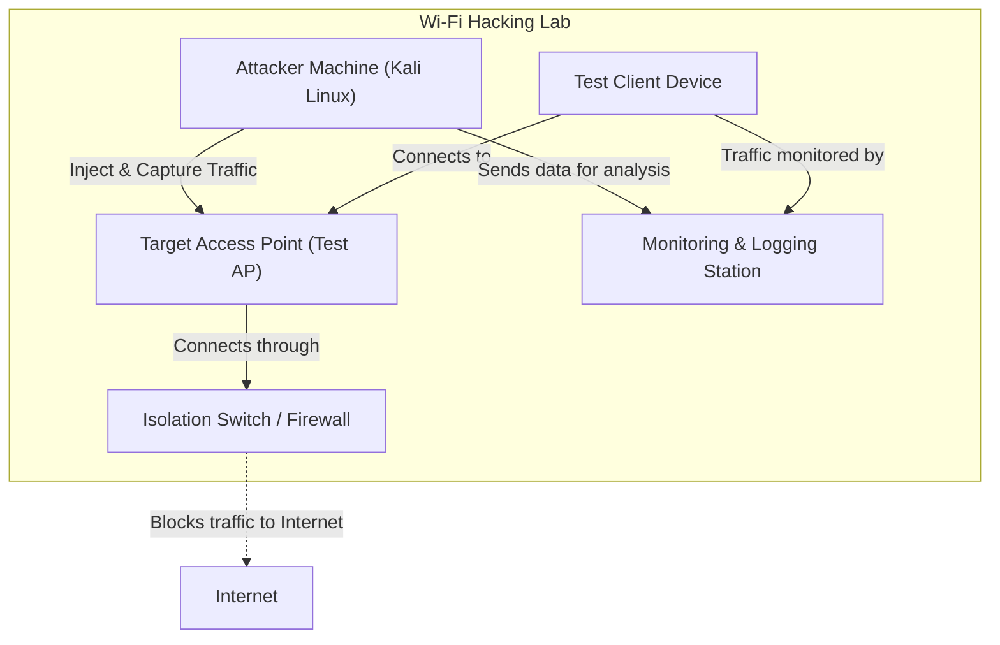

# Wireless Hacking Part 2

## About

In this second part of the Wireless Hacking series, we shift our focus from theory to practice. Before diving into real-world attacks, it’s crucial to prepare a safe, legal, and isolated environment to experiment and learn.
Join us as we continue this educational journey through ethical hacking and wireless security.

## Environment

Before performing any wireless attacks or experiments, it's crucial to set up a safe and isolated testing environment. Here are two solid options depending on your setup and preferences:

### Option 1: Installing Kali Linux on a Virtual Machine

**Recommended software**: [VirtualBox](https://www.virtualbox.org/) or [VMware Workstation Player](https://www.vmware.com/products/workstation-player.html) (free for personal use).

#### Downloads

- [Kali Linux VirtualBox Image](https://www.kali.org/get-kali/#kali-virtual-machines)
- [Kali Linux ISO Image](https://www.kali.org/get-kali/#kali-installer-images)

#### Installation Steps

- Make sure virtualization (Intel VT or AMD-V) is enabled in your computer’s BIOS/UEFI settings.
- Allocate at least **2 GB of RAM** and **20 GB of disk space**.
- Set the network adapter to **"Bridged Adapter"** to give Kali access to your local network.
- Use a **USB Wi-Fi adapter that supports monitor mode**, and pass it through to the VM.

---

### Option 2: Installing Kali Linux on a Raspberry Pi

**Required hardware**:

- Raspberry Pi 4
- MicroSD card (minimum 16 GB)
- Power supply, keyboard, mouse, and HDMI screen

#### Downloads Links

- [Kali Linux ARM image for Raspberry Pi](https://www.kali.org/get-kali/#kali-arm)

#### Steps

1. Use [Raspberry Pi Imager](https://www.raspberrypi.org/software/) or a similar tool to flash the Kali image onto the microSD card.
2. Insert the card into the Raspberry Pi, connect all peripherals, and boot it up.
3. Follow the on-screen setup instructions and ensure your Wi-Fi adapter is compatible with monitor mode.

## Architecture

```mermaid
graph TD
    subgraph "Wi-Fi Hacking Lab"
        attacker["Attacker Machine (Kali Linux)"]
        ap["Target Access Point (Test AP)"]
        client["Test Client Device"]
        firewall["Isolation Switch / Firewall"]
        monitor["Monitoring & Logging Station"]
    end

    attacker -->|Inject & Capture Traffic| ap
    client -->|Connects to| ap
    ap -->|Connects through| firewall
    attacker -->|Sends data for analysis| monitor
    client -->|Traffic monitored by| monitor
    firewall -.->|Blocks traffic to Internet| Internet["Internet"]
```

---

> Author: [ProxyGeek](https://github.com/Pr0xyG33k)  
> URL: https://Pr0xyG33k.github.io/posts/wireless02/  

