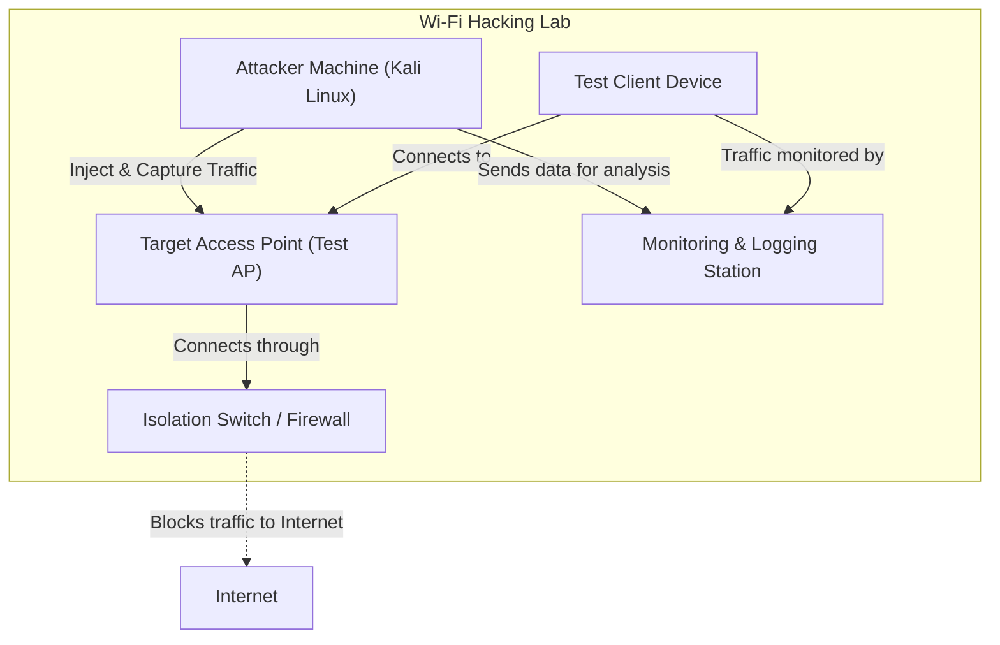

# Wireless Hacking Part 2


## About

In this second part of the Wireless Hacking series, we shift our focus from theory to practice. Before diving into real-world attacks, it’s crucial to prepare a safe, legal, and isolated environment to experiment and learn.
Join us as we continue this educational journey through ethical hacking and wireless security.

## Environment

Before performing any wireless attacks or experiments, it's crucial to set up a safe and isolated testing environment. Here are two solid options depending on your setup and preferences:

### Option 1: Installing Kali Linux on a Virtual Machine

**Recommended software**: [VirtualBox](https://www.virtualbox.org/) or [VMware Workstation Player](https://www.vmware.com/products/workstation-player.html) (free for personal use) or [QEMU/KVM](https://www.qemu.org/download/).

#### Downloads Links

- [Kali Linux Virtual Machines Image](https://www.kali.org/get-kali/#kali-virtual-machines)
- [Kali Linux ISO Image](https://www.kali.org/get-kali/#kali-installer-images)

#### Installation Steps

- Make sure virtualization (Intel VT or AMD-V) is enabled in your computer’s BIOS/UEFI settings.
- Allocate at least **2 GB of RAM** and **20 GB of disk space**.
- Set the network adapter to **"Bridged Adapter"** to give Kali access to your local network.
- Use a **USB Wi-Fi adapter that supports monitor mode**, and pass it through to the VM.

---

### Option 2: Installing Kali Linux on a Raspberry Pi

**Required hardware**:

- Raspberry Pi 4
- MicroSD card (minimum 16 GB)
- Power supply, keyboard, mouse, and HDMI screen

#### Links

- [Kali Linux ARM image for Raspberry Pi](https://www.kali.org/get-kali/#kali-arm)

#### Steps

1. Use [Raspberry Pi Imager](https://www.raspberrypi.org/software/) or a similar tool to flash the Kali image onto the microSD card.
2. Insert the card into the Raspberry Pi, connect all peripherals, and boot it up.
3. Follow the on-screen setup instructions and ensure your Wi-Fi adapter is compatible with monitor mode.

## Architecture


```mermaid
graph TD
    subgraph "Wi-Fi Hacking Lab"
        attacker["Attacker Machine (Kali Linux)"]
        ap["Target Access Point (Test AP)"]
        client["Test Client Device"]
        firewall["Isolation Switch / Firewall"]
        monitor["Monitoring & Logging Station"]
    end

    attacker -->|Inject & Capture Traffic| ap
    client -->|Connects to| ap
    ap -->|Connects through| firewall
    attacker -->|Sends data for analysis| monitor
    client -->|Traffic monitored by| monitor
    firewall -.->|Blocks traffic to Internet| Internet["Internet"]
```

## QEMU/KVM

To begin, open **virt-manager** (Virtual Machine Manager) on your Arch Linux system. This graphical tool will allow you to easily manage virtual machines using QEMU/KVM in the background. Once the application is open, click on the **"Create a new virtual machine"** button.

In the wizard that appears, select **"Local install media (ISO image or CDROM)"**, then browse to and select the **Kali Linux ISO file** you previously downloaded. Next, choose the OS type as **Linux**, and for the version, select either **Debian 10/11 (64-bit)** or **Generic Linux (64-bit)**—both will work well for Kali.

<div style="display: flex; justify-content: space-between;">
  
  
</div>

You’ll then be prompted to assign system resources to the VM. It is recommended to allocate **at least 2GB of RAM**, but **4GB (4096MB)** is ideal if your host machine allows it. You should also assign **2 or more CPU cores** to ensure smooth performance. After this, you’ll create a virtual hard disk—make sure it is **at least 20GB**, and **dynamically allocated** to save space.

Once these steps are complete, click **Finish** to create and launch the virtual machine.

> [!CAUTION]
> Before proceeding with creating the virtual machine, it's strongly recommended to **verify the SHA256 checksum** of the Kali Linux ISO. This helps ensure that the file has not been corrupted during download or maliciously altered.

### Checksum

```bash
#!/bin/bash

set -e

VERSION="2025.1c"
BASE_URL="https://cdimage.kali.org/kali-$VERSION"
ISO="kali-linux-$VERSION-installer-amd64.iso"

echo "Creating download directory..."
mkdir -p ~/Downloads/iso/kali-$VERSION
cd ~/Downloads/iso/kali-$VERSION

echo "Downloading Kali Linux ISO and verification files..."
wget -q --show-progress "$BASE_URL/$ISO"
wget -q --show-progress "$BASE_URL/SHA256SUMS"
wget -q --show-progress "$BASE_URL/SHA256SUMS.gpg"

echo "Importing Kali Linux official GPG key..."
gpg --keyserver hkps://keyserver.ubuntu.com --recv-keys 44C6513A8E4FB3D30875F758ED444FF07D8D0BF6

echo "Verifying SHA256SUMS signature..."
gpg --verify SHA256SUMS.gpg SHA256SUMS

echo "Verifying ISO checksum..."
sha256sum -c SHA256SUMS 2>/dev/null | grep "$ISO"

echo "All done! If you see '$ISO: OK' above, your ISO is verified and safe to use."
```

```output
Creating download directory...
Downloading Kali Linux ISO and verification files...
kali-linux-2025.1c-installer 100%[===========================================>]   4.13G   107MB/s    in 41s     
SHA256SUMS                   100%[===========================================>]   2.80K  --.-KB/s    in 0s      
SHA256SUMS.gpg               100%[===========================================>]     833  --.-KB/s    in 0s      
Importing Kali Linux official GPG key...
gpg: key ED444FF07D8D0BF6: 2 duplicate signatures removed
gpg: key ED444FF07D8D0BF6: "Kali Linux Repository <devel@kali.org>" not changed
gpg: Total number processed: 1
gpg:              unchanged: 1
Verifying SHA256SUMS signature...
gpg: Signature made Thu 24 Apr 2025 05:31:10 AM CEST
gpg:                using RSA key 827C8569F2518CC677FECA1AED65462EC8D5E4C5
gpg: checking the trustdb
gpg: marginals needed: 3  completes needed: 1  trust model: pgp
gpg: depth: 0  valid:   2  signed:   0  trust: 0-, 0q, 0n, 0m, 0f, 2u
gpg: next trustdb check due at 2028-04-17
gpg: Good signature from "Kali Linux Archive Automatic Signing Key (2025) <devel@kali.org>" [ultimate]
Verifying ISO checksum...
kali-linux-2025.1c-installer-amd64.iso: OK
kali-linux-2025.1c-installer-amd64.iso.torrent: FAILED open or read
All done! If you see 'kali-linux-2025.1c-installer-amd64.iso: OK' above, your ISO is verified and safe to use.
```

### Configuring

Before installing Kali, a few adjustments to the virtual hardware settings are necessary. In **virt-manager**, select your newly created Kali VM and click **Open** to access its console. Then click the **lightbulb icon**, which opens the **Virtual Hardware Details** panel.

Inside this panel, check that the **Kali Linux ISO** is correctly attached as the **boot media** under the "IDE CDROM" section. Next, review the **network settings**. By default, the network is set to **NAT**, which provides Internet access through your host. However, if you want the VM to be visible on your local network (useful for advanced testing), you can change it to **Bridged** mode and select your host interface.

Finally, scroll down to ensure that a **USB controller** (either USB 2.0 or 3.0) is present and enabled. This will be important later when attaching a USB Wi-Fi adapter.

### Installing

Now that your VM is ready, start it up. The system should boot directly into the Kali Linux ISO. On the boot menu, select **"Graphical Install"** to launch the graphical installer, which is easier for most users to navigate.

Proceed through the installation by choosing your **language**, **country**, and **keyboard layout**. You’ll then configure your **network settings**, including a hostname (e.g., `kali-vm`) and an optional domain name. After that, create a **user account and password**. Kali now defaults to a non-root user, which improves security and mirrors real-world Linux use.

For disk setup, select **Guided - use entire disk**, which is the simplest and safest option for a VM. Confirm your partitioning choices and let the installer complete the process. Once installation is finished, **remove the ISO** from the virtual CD-ROM and **reboot** the VM.

### Setting

If you plan to use tools that require raw access to a wireless interface, such as `aircrack-ng` or `bettercap`, you’ll need to passthrough a **USB Wi-Fi adapter** that supports **monitor mode and packet injection**.

To do this, plug your adapter into the host machine. Then, with the Kali VM powered off, open **Virtual Hardware Details** in virt-manager. Click **"Add Hardware"**, choose **"USB Host Device"**, and select your USB Wi-Fi adapter from the list.

Once added, start the VM again. Inside Kali Linux, open a terminal and run:

```bash
iwconfig
```


---

> Author: [ProxyGeek](https://github.com/Pr0xyG33k)  
> URL: https://Pr0xyG33k.github.io/posts/wireless02/  

