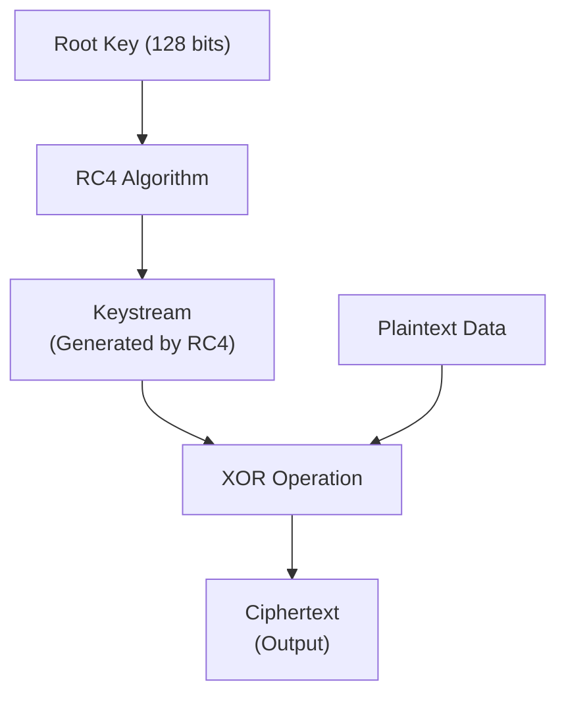
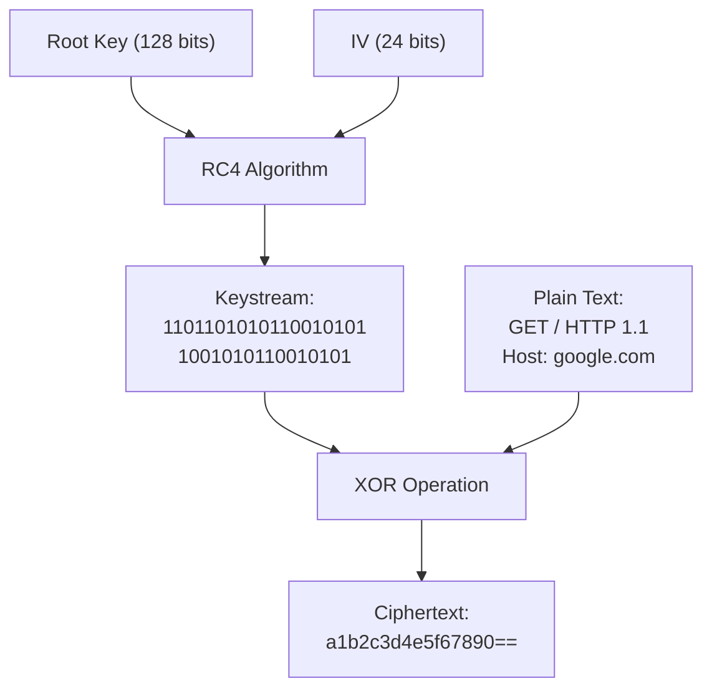
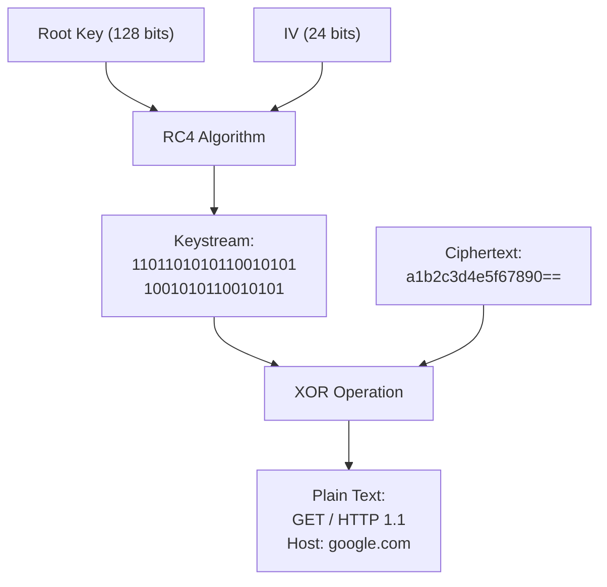
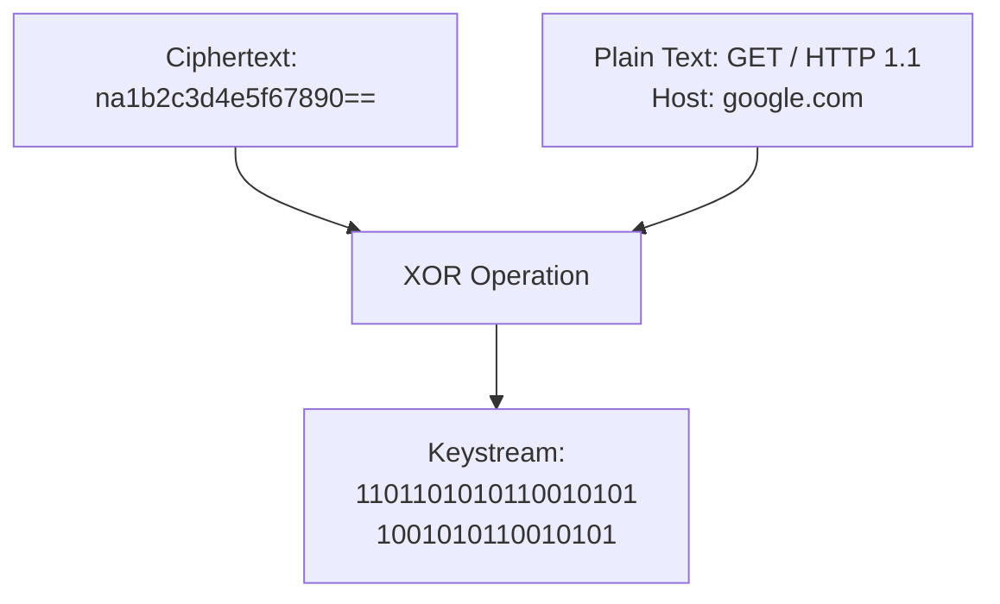
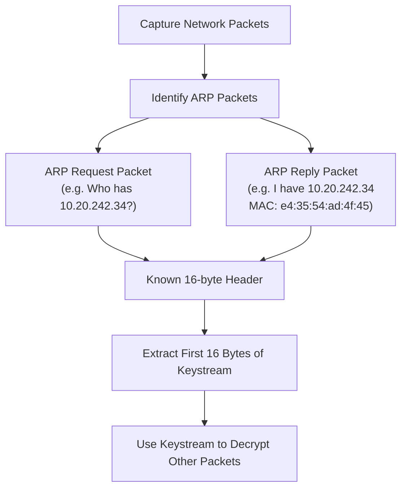

# Wireless Hacking Part 3


## About

In Part 3 of our Wireless Hacking series, we will delve into the practical application of wireless attacks. After exploring the basics of Wi-Fi and setting up a safe testing environment, it’s time to get hands-on. In this post, we’ll focus on attacking WEP (Wired Equivalent Privacy) — a once-standard but now outdated and highly vulnerable wireless encryption protocol.

In this post, you’ll learn how WEP works, the cryptographic weaknesses it suffers from, and step-by-step how to exploit these flaws using tools like **aircrack-ng** and **aireplay-ng**. By the end, you’ll understand why WEP is obsolete and how attackers can recover a WEP key within minutes.

> [!CAUTION]
> **Ethical Hacking Reminder**: Only perform wireless penetration tests on networks you own or have explicit permission to test. Unauthorized hacking is illegal and unethical.

## RC4/ Stream Cipher

The process starts when the user creates a root key of size 128 bits. This root key is then encrypted using the RC4 algorithm, which generates a keystream. Once the keystream is generated, it is combined with the plaintext data using an XOR gate (logical operation). The result of this operation gives us the **ciphertext**, which can then be sent.



## WEP Packet

The process of sending a packet using WEP begins with appending a 24-bit Initialization Vector (IV) to the root key. This new combined key is then input into the RC4 encryption algorithm, which generates a keystream unique to that packet. Next, this keystream is combined with the plaintext data using an XOR operation, producing the ciphertext that will be transmitted over the wireless network.

Since the IV changes with every packet, it is appended along with the ciphertext. This is necessary because the receiving device (such as a router) needs the IV to recreate the same keystream and correctly decrypt the message. Without the IV, decryption would not be possible, as the key would not match the keystream used for encryption.



## Router-side Decryption

During router-side decryption, the process begins by appending the root key with the 24-bit Initialization Vector (IV) extracted from the received data packet. This new key is then used as input to the RC4 algorithm, which generates a pseudorandom keystream. Next, this keystream is combined with the ciphertext using an XOR operation.



The result is the original data stream requested by the device. However, it is important to note that the mathematical weaknesses of RC4 expose this method to vulnerabilities: by collecting enough keystreams associated with different IV values, an attacker can analyze the data to recover the network’s secret key.

## Methodology

Cracking a wireless network — especially one secured with WEP — relies on a deep understanding of stream cipher mechanics. At the heart of this process is the extraction of a keystream, a pseudorandom sequence used to encrypt data. To obtain the keystream, you need both ciphertext and at least a portion of the plaintext. By XORing the two, the keystream can be revealed, which can then be reused to decrypt other packets or even recover the original WEP key.



The first practical step is capturing ciphertext, which is relatively straightforward. By setting your wireless interface to monitor mode, you can passively listen to all wireless traffic in range. This allows you to capture encrypted packets — including ARP requests and broadcast messages — without needing to be connected to the network. These packets become the foundation for further steps like traffic injection, keystream recovery, and ultimately key extraction.

This methodology is central to WEP cracking and sets the stage for more advanced techniques, such as ARP replay attacks and dictionary-based keystream matching, which exploit predictable plaintext to speed up the attack process.

### Capture Ciphertext

Capturing ciphertext is relatively simple.
By setting the network adapter to monitor mode, it becomes possible to listen to and collect wireless data packets transmitted over the air.

### Retrieve Plaintext

Extracting the plaintext from encrypted packets is a more complex task. Fortunately, the ARP (Address Resolution Protocol) provides useful assistance in this process. ARP operates with two primary packet types: requests and replies. An ARP request is essentially a broadcast message that asks for the MAC address corresponding to a specific IP on the local network — for instance, “Who has IP 10.20.242.34?” In turn, the device with that IP responds with an ARP reply, sharing its MAC address, such as “I have 10.20.242.34, MAC address e4:35:54:ad:4f:45.”

A key point is that both ARP request and reply packets contain a header of fixed, predictable length — 16 bytes. By capturing these packets, it is possible to know part of the plaintext in advance. This known plaintext can then be used to recover the initial bytes of the encryption keystream. Therefore, capturing a large number of ARP packets significantly aids the decryption effort.

However, the attack demands a substantial volume of packets — on the order of 10,000 — to be effective. Such high traffic is typically found only on busy networks, making it challenging to gather enough data. To address this limitation, attackers often resort to an ARP replay technique.

### Arp Replay attack

With an ARP replay attack, an adversary captures an ARP request and repeatedly injects it into the network. This forces the client or network devices to generate many packets, each with new initialization vectors and keystream fragments. By collecting these replayed packets, the attacker gains access to a wealth of encrypted data that can be analyzed. For example, sending a single ARP request repeatedly in a network with one client can produce multiple keystream samples to capture and exploit.



## Exploiting WEP

## Monitoring

As we continue to explore wireless security in a controlled and isolated environment, we can utilize tools like Wifite2 to audit and capture network data. For example, the following command:

```bash
┌──(proxygeek㉿VMware-kali)-[~]
└─$ sudo wifite --kill
   .               .    
 .´  ·  .     .  ·  `.  wifite2 2.7.0
 :  :  :  (¯)  :  :  :  a wireless auditor by derv82
 `.  ·  ` /¯\ ´  ·  .´  maintained by kimocoder
   `     /¯¯¯\     ´    https://github.com/kimocoder/wifite2

 [+] option: kill conflicting processes enabled
 [+] Using wlan0 already in monitor mode                                                                         
```

This command helps stop conflicting processes (like `NetworkManager` or `wpa_supplicant`), and sets your wireless interface to monitor mode, which is essential for packet sniffing and capturing data from nearby networks. Once in monitor mode, you can analyze various wireless networks in your environment.

Here is a sample of the output you might see when running wifite:

```bash
   NUM                      ESSID   CH  ENCR    PWR    WPS  CLIENT                                               
   ---  -------------------------  ---  -----   ----   ---  ------
     1       (1X:XX:XX:XX:XX:XX)     1  WPA     99db    no                                                       
     2       (2X:XX:XX:XX:XX:XX)    11  WPA     99db    no                                                       
     3              WIFI01-GUEST     8  WPA-P   63db    no                                                       
     4              WIFI02-GUEST     6  WPA-P   38db  lock                                                       
     5       (3X:XX:XX:XX:XX:XX)     6  WPA     38db    no                                                       
     6              WIFI03-GUEST     6  WPA-P   30db  lock                                                       
     7       (4X:XX:XX:XX:XX:XX)     6  WPA     29db    no                                                       
     8       (5X:XX:XX:XX:XX:XX)     1  WPA-P   21db    no                                                       
     9              WIFI04-GUEST     1  WPA-P   20db   yes                                                       
    10              WIFI05-GUEST     6  WPA-P   20db   yes                                                       
    11              WIFI06-GUEST    11  WPA-P   19db  lock
```

In this list, each entry represents a wireless access point (AP) detected within range, with information about its ESSID (network name), channel, encryption type, signal strength (PWR), WPS status, and connected clients.

This tool is essential for understanding and evaluating the security of wireless networks within a controlled and isolated environment, providing insight into nearby networks and preparing for more complex penetration testing in future parts of this series.


---

> Author: [ProxyGeek](https://github.com/Pr0xyG33k)  
> URL: https://Pr0xyG33k.github.io/posts/wireless03/  

