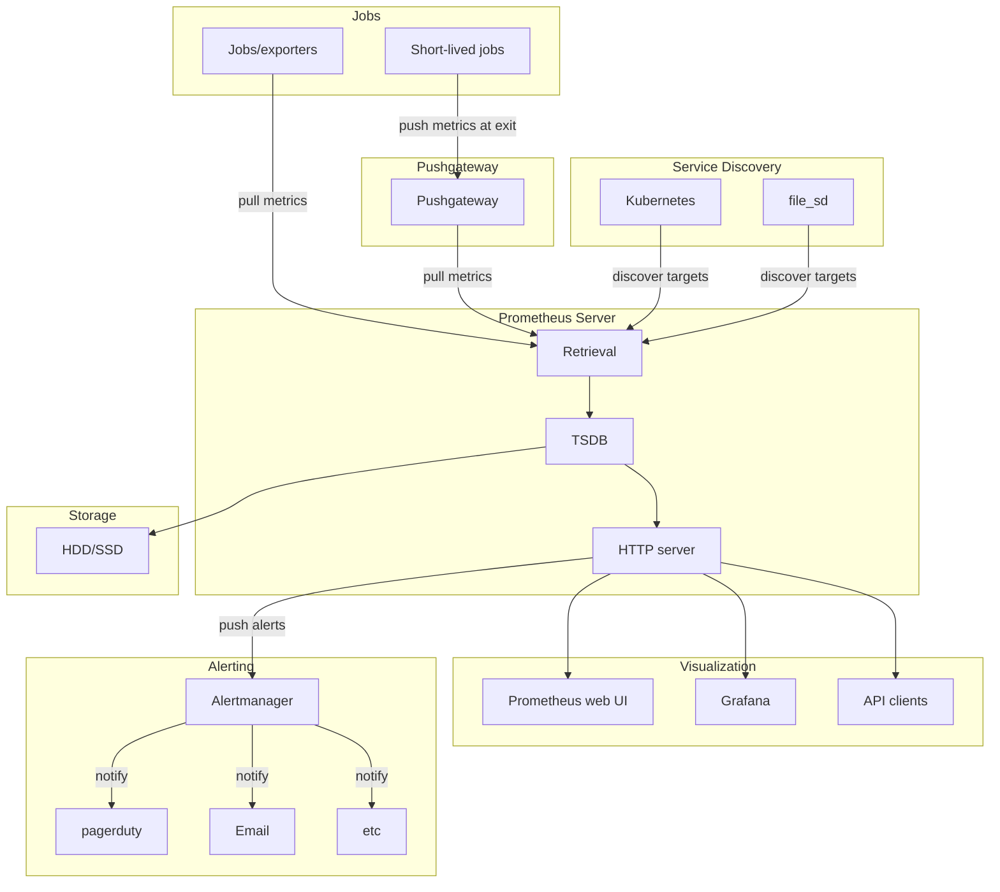

# Honeypot Server

## About

[Prometheus](https://prometheus.io) is an open-source monitoring and alerting toolkit designed for reliability and scalability. Initially developed at SoundCloud in 2012, it's now a graduated project under the Cloud Native Computing Foundation (CNCF).

## Git

This project uses a clean and scalable Git workflow to organize the development and deployment lifecycle. By leveraging feature branches and a clear separation between stable and in-progress code, we ensure that our honeypot system remains reliable while encouraging rapid iteration and experimentation.

### Branch Strategy

- **`main`** – The production branch. Only stable, tested code is merged here.
- **`develop`** – Active development branch. All features are integrated here before being released.
- **`feature/*`** – Temporary branches for individual features such as log capture, alerting, or interface improvements.

### Git Flow


gitGraph
    commit id: "Initial commit"
    commit id: "Setup Hugo and theme"
    branch develop
    checkout develop
    commit id: "Create honeypot layout and structure"
    branch feature/logging
    checkout feature/logging
    commit id: "Implement traffic logging"
    checkout develop
    merge feature/logging
    branch feature/alerting
    checkout feature/alerting
    commit id: "Add alert system for intrusions"
    commit id: "Connect webhook for alert delivery"
    checkout develop
    merge feature/alerting
    branch feature/visualization
    checkout feature/visualization
    commit id: "Add data visualization dashboard"
    checkout develop
    merge feature/visualization
    commit id: "Final testing and cleanup"
    checkout main
    merge develop
    commit id: "Release v1.0"


## Architecture

Prometheus automatically collects metrics from applications and services using exporters. For short-lived jobs, it relies on an intermediary called the Pushgateway. It discovers monitoring targets through automatic methods like Kubernetes or configuration files. The collected data is stored in a specialized time series database called TSDB on disk. Prometheus provides a web interface and can integrate with Grafana for data visualization. It also manages alerts via the Alertmanager, which sends notifications when issues occur. This architecture enables efficient and comprehensive system monitoring.

---

> Author: [ProxyGeek](https://github.com/Pr0xyG33k)  
> URL: https://Pr0xyG33k.github.io/projects/honeypot/  

