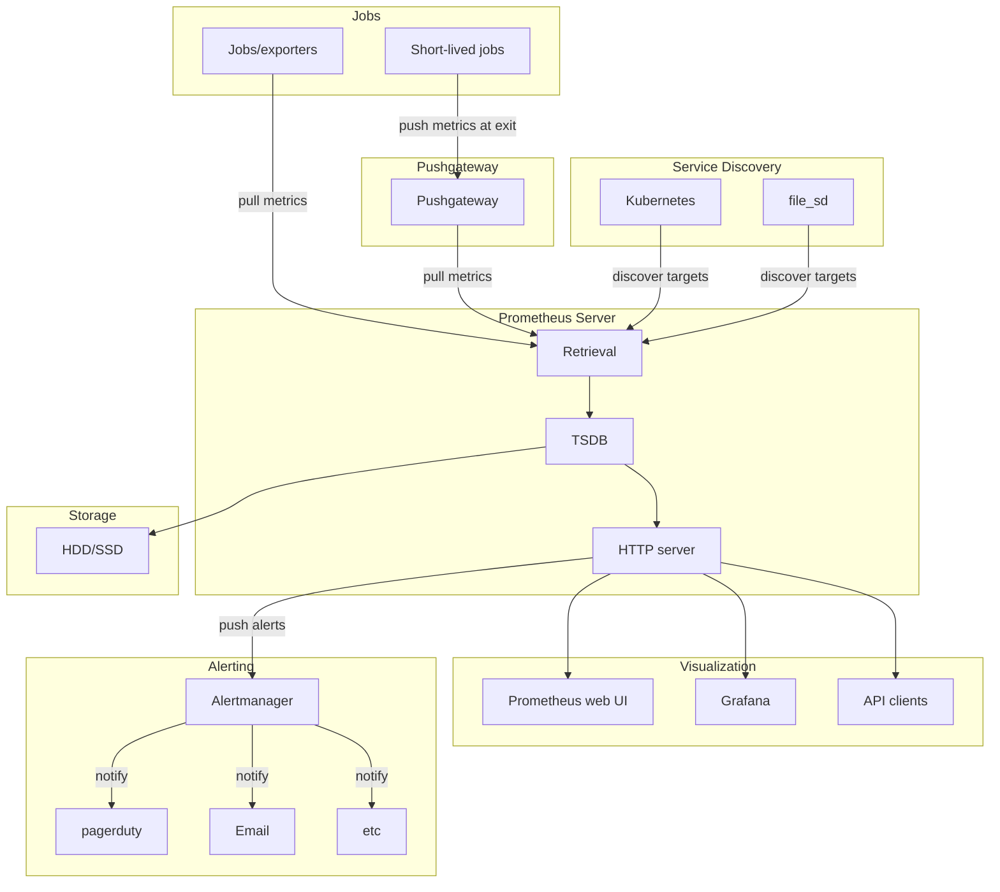

# Honeypot Server

## About

[Prometheus](https://prometheus.io) is an open-source monitoring and alerting toolkit designed for reliability and scalability. Initially developed at SoundCloud in 2012, it's now a graduated project under the Cloud Native Computing Foundation (CNCF).

## Architecture

```mermaid
graph TD

subgraph "Jobs"
  J1[Jobs/exporters]
  J2[Short-lived jobs]
end

subgraph "Service Discovery"
  SD1[Kubernetes]
  SD2[file_sd]
end

subgraph "Prometheus Server"
  RET[Retrieval]
  TSDB[TSDB]
  HTTP[HTTP server]
end

subgraph "Storage"
  HDD[HDD/SSD]
end

subgraph "Visualization"
  UI[Prometheus web UI]
  G[Grafana]
  API[API clients]
end

subgraph "Alerting"
  AM[Alertmanager]
  PD[pagerduty]
  Email[Email]
  ETC[etc]
end

subgraph "Pushgateway"
  PG[Pushgateway]
end

%% Data Flow
J1 -->|pull metrics| RET
J2 -->|push metrics at exit| PG
PG -->|pull metrics| RET
SD1 -->|discover targets| RET
SD2 -->|discover targets| RET
RET --> TSDB
TSDB --> HTTP
TSDB --> HDD
HTTP --> UI
HTTP --> G
HTTP --> API
HTTP -->|push alerts| AM
AM -->|notify| PD
AM -->|notify| Email
AM -->|notify| ETC


```

---

> Author: [ProxyGeek](https://github.com/Pr0xyG33k)  
> URL: https://Pr0xyG33k.github.io/projects/honeypot/  

